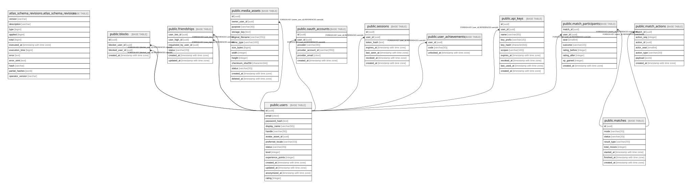

# transcendence

## Tables

| Name | Columns | Comment | Type |
| ---- | ------- | ------- | ---- |
| [atlas_schema_revisions.atlas_schema_revisions](atlas_schema_revisions.atlas_schema_revisions.md) | 12 |  | BASE TABLE |
| [public.users](public.users.md) | 14 |  | BASE TABLE |
| [public.blocks](public.blocks.md) | 4 |  | BASE TABLE |
| [public.friendships](public.friendships.md) | 6 |  | BASE TABLE |
| [public.media_assets](public.media_assets.md) | 13 |  | BASE TABLE |
| [public.oauth_accounts](public.oauth_accounts.md) | 6 |  | BASE TABLE |
| [public.sessions](public.sessions.md) | 7 |  | BASE TABLE |
| [public.matches](public.matches.md) | 8 |  | BASE TABLE |
| [public.match_participants](public.match_participants.md) | 8 |  | BASE TABLE |
| [public.user_achievements](public.user_achievements.md) | 3 |  | BASE TABLE |
| [public.match_actions](public.match_actions.md) | 7 |  | BASE TABLE |

## Stored procedures and functions

| Name | ReturnType | Arguments | Type |
| ---- | ------- | ------- | ---- |
| public.citextin | citext | cstring | FUNCTION |
| public.citextout | cstring | citext | FUNCTION |
| public.citextrecv | citext | internal | FUNCTION |
| public.citextsend | bytea | citext | FUNCTION |
| public.citext | citext | character | FUNCTION |
| public.citext | citext | boolean | FUNCTION |
| public.citext | citext | inet | FUNCTION |
| public.citext_eq | bool | citext, citext | FUNCTION |
| public.citext_ne | bool | citext, citext | FUNCTION |
| public.citext_lt | bool | citext, citext | FUNCTION |
| public.citext_le | bool | citext, citext | FUNCTION |
| public.citext_gt | bool | citext, citext | FUNCTION |
| public.citext_ge | bool | citext, citext | FUNCTION |
| public.citext_cmp | int4 | citext, citext | FUNCTION |
| public.citext_hash | int4 | citext | FUNCTION |
| public.citext_smaller | citext | citext, citext | FUNCTION |
| public.citext_larger | citext | citext, citext | FUNCTION |
| public.min | citext | citext | a |
| public.max | citext | citext | a |
| public.texticlike | bool | citext, citext | FUNCTION |
| public.texticnlike | bool | citext, citext | FUNCTION |
| public.texticregexeq | bool | citext, citext | FUNCTION |
| public.texticregexne | bool | citext, citext | FUNCTION |
| public.texticlike | bool | citext, text | FUNCTION |
| public.texticnlike | bool | citext, text | FUNCTION |
| public.texticregexeq | bool | citext, text | FUNCTION |
| public.texticregexne | bool | citext, text | FUNCTION |
| public.regexp_match | _text | citext, citext | FUNCTION |
| public.regexp_match | _text | citext, citext, text | FUNCTION |
| public.regexp_matches | _text | citext, citext | FUNCTION |
| public.regexp_matches | _text | citext, citext, text | FUNCTION |
| public.regexp_replace | text | citext, citext, text | FUNCTION |
| public.regexp_replace | text | citext, citext, text, text | FUNCTION |
| public.regexp_split_to_array | _text | citext, citext | FUNCTION |
| public.regexp_split_to_array | _text | citext, citext, text | FUNCTION |
| public.regexp_split_to_table | text | citext, citext | FUNCTION |
| public.regexp_split_to_table | text | citext, citext, text | FUNCTION |
| public.strpos | int4 | citext, citext | FUNCTION |
| public.replace | text | citext, citext, citext | FUNCTION |
| public.split_part | text | citext, citext, integer | FUNCTION |
| public.translate | text | citext, citext, text | FUNCTION |
| public.citext_pattern_lt | bool | citext, citext | FUNCTION |
| public.citext_pattern_le | bool | citext, citext | FUNCTION |
| public.citext_pattern_gt | bool | citext, citext | FUNCTION |
| public.citext_pattern_ge | bool | citext, citext | FUNCTION |
| public.citext_pattern_cmp | int4 | citext, citext | FUNCTION |
| public.citext_hash_extended | int8 | citext, bigint | FUNCTION |

## Relations

---

> Generated by [tbls](https://github.com/k1LoW/tbls)
