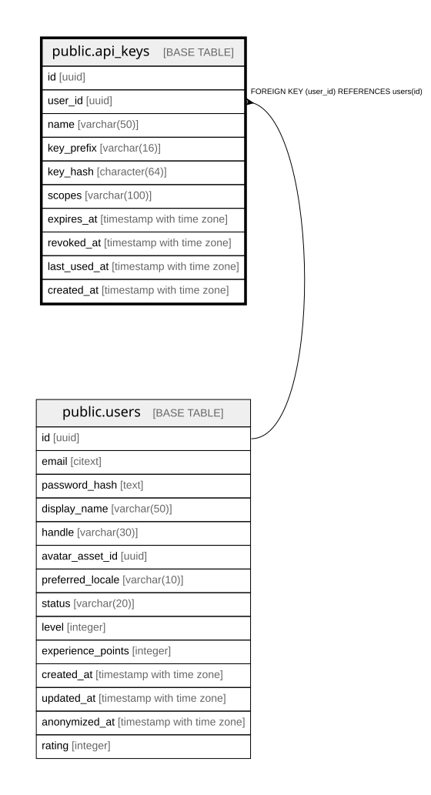

# public.api_keys

## Description

## Columns

| Name | Type | Default | Nullable | Children | Parents | Comment |
| ---- | ---- | ------- | -------- | -------- | ------- | ------- |
| id | uuid | gen_random_uuid() | false |  |  |  |
| user_id | uuid |  | false |  | [public.users](public.users.md) |  |
| name | varchar(50) |  | false |  |  |  |
| key_prefix | varchar(16) |  | false |  |  |  |
| key_hash | character(64) |  | false |  |  |  |
| scopes | varchar(100) |  | false |  |  |  |
| expires_at | timestamp with time zone |  | true |  |  |  |
| revoked_at | timestamp with time zone |  | true |  |  |  |
| last_used_at | timestamp with time zone |  | true |  |  |  |
| created_at | timestamp with time zone |  | false |  |  |  |

## Constraints

| Name | Type | Definition |
| ---- | ---- | ---------- |
| fk_api_keys_user | FOREIGN KEY | FOREIGN KEY (user_id) REFERENCES users(id) |
| api_keys_pkey | PRIMARY KEY | PRIMARY KEY (id) |

## Indexes

| Name | Definition |
| ---- | ---------- |
| api_keys_pkey | CREATE UNIQUE INDEX api_keys_pkey ON public.api_keys USING btree (id) |
| idx_api_keys_key_hash | CREATE UNIQUE INDEX idx_api_keys_key_hash ON public.api_keys USING btree (key_hash) |
| idx_api_keys_user_id | CREATE INDEX idx_api_keys_user_id ON public.api_keys USING btree (user_id) |

## Relations

---

> Generated by [tbls](https://github.com/k1LoW/tbls)
