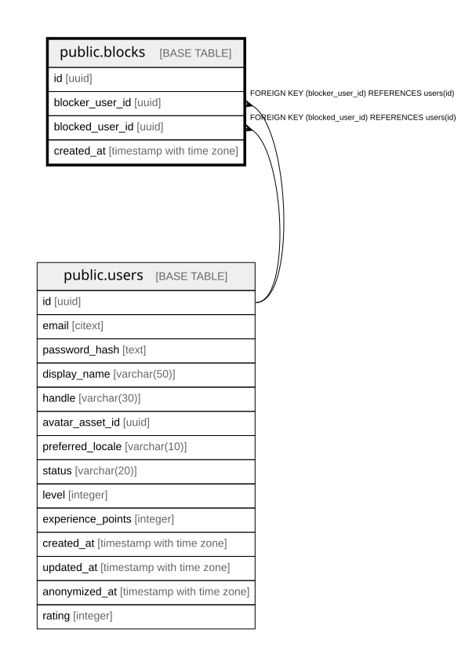

# public.blocks

## Columns

| Name | Type | Default | Nullable | Children | Parents | Comment |
| ---- | ---- | ------- | -------- | -------- | ------- | ------- |
| id | uuid | gen_random_uuid() | false |  |  |  |
| blocker_user_id | uuid |  | false |  | [public.users](public.users.md) |  |
| blocked_user_id | uuid |  | false |  | [public.users](public.users.md) |  |
| created_at | timestamp with time zone |  | false |  |  |  |

## Constraints

| Name | Type | Definition |
| ---- | ---- | ---------- |
| fk_blocks_blocked | FOREIGN KEY | FOREIGN KEY (blocked_user_id) REFERENCES users(id) |
| fk_blocks_blocker | FOREIGN KEY | FOREIGN KEY (blocker_user_id) REFERENCES users(id) |
| blocks_pkey | PRIMARY KEY | PRIMARY KEY (id) |

## Indexes

| Name | Definition |
| ---- | ---------- |
| blocks_pkey | CREATE UNIQUE INDEX blocks_pkey ON public.blocks USING btree (id) |
| idx_blocks_blocked_user_id | CREATE INDEX idx_blocks_blocked_user_id ON public.blocks USING btree (blocked_user_id) |
| ux_blocks_pair | CREATE UNIQUE INDEX ux_blocks_pair ON public.blocks USING btree (blocker_user_id, blocked_user_id) |

## Relations

---

> Generated by [tbls](https://github.com/k1LoW/tbls)
