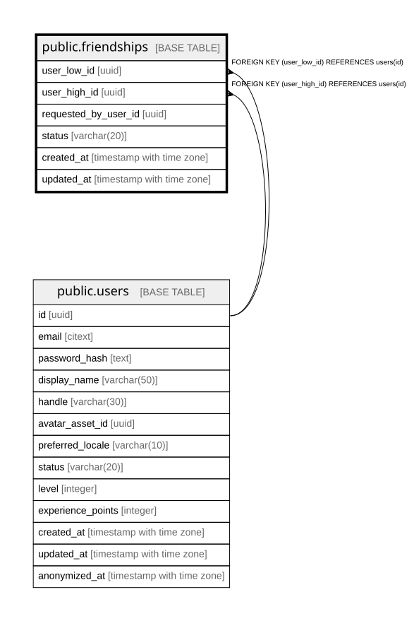

# public.friendships

## Description

## Columns

| Name | Type | Default | Nullable | Children | Parents | Comment |
| ---- | ---- | ------- | -------- | -------- | ------- | ------- |
| user_low_id | uuid |  | false |  | [public.users](public.users.md) |  |
| user_high_id | uuid |  | false |  | [public.users](public.users.md) |  |
| requested_by_user_id | uuid |  | false |  |  |  |
| status | varchar(20) |  | false |  |  |  |
| created_at | timestamp with time zone |  | false |  |  |  |
| updated_at | timestamp with time zone |  | false |  |  |  |

## Constraints

| Name | Type | Definition |
| ---- | ---- | ---------- |
| chk_friendships_status | CHECK | CHECK (((status)::text = ANY (ARRAY[('pending'::character varying)::text, ('accepted'::character varying)::text, ('rejected'::character varying)::text]))) |
| fk_friendships_user_high | FOREIGN KEY | FOREIGN KEY (user_high_id) REFERENCES users(id) |
| fk_friendships_user_low | FOREIGN KEY | FOREIGN KEY (user_low_id) REFERENCES users(id) |
| friendships_pkey | PRIMARY KEY | PRIMARY KEY (user_low_id, user_high_id) |

## Indexes

| Name | Definition |
| ---- | ---------- |
| friendships_pkey | CREATE UNIQUE INDEX friendships_pkey ON public.friendships USING btree (user_low_id, user_high_id) |
| idx_friendships_high_status | CREATE INDEX idx_friendships_high_status ON public.friendships USING btree (user_high_id, status) |

## Relations

---

> Generated by [tbls](https://github.com/k1LoW/tbls)
