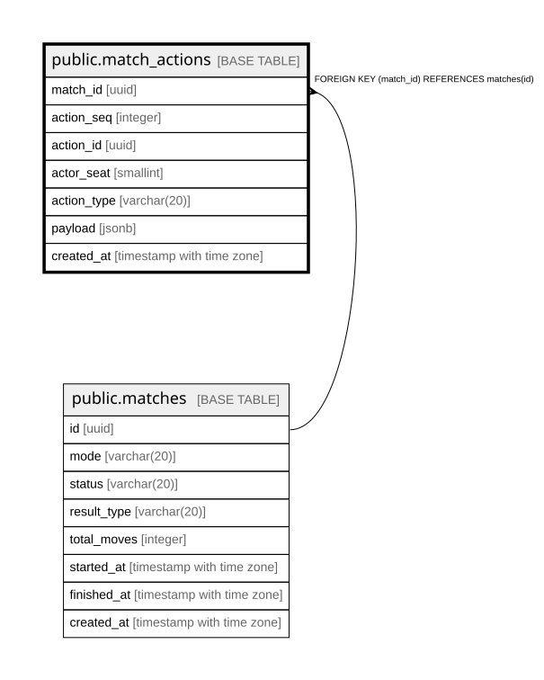

# public.match_actions

## Description

## Columns

| Name | Type | Default | Nullable | Children | Parents | Comment |
| ---- | ---- | ------- | -------- | -------- | ------- | ------- |
| match_id | uuid |  | false |  | [public.matches](public.matches.md) |  |
| action_seq | integer |  | false |  |  |  |
| action_id | uuid |  | false |  |  |  |
| actor_seat | smallint |  | false |  |  |  |
| action_type | varchar(20) |  | false |  |  |  |
| payload | jsonb | '{}'::jsonb | false |  |  |  |
| created_at | timestamp with time zone |  | false |  |  |  |

## Constraints

| Name | Type | Definition |
| ---- | ---- | ---------- |
| chk_match_actions_action_seq | CHECK | CHECK ((action_seq >= 1)) |
| chk_match_actions_action_type | CHECK | CHECK (((action_type)::text = ANY (ARRAY[('move'::character varying)::text, ('wall'::character varying)::text, ('resign'::character varying)::text, ('timeout'::character varying)::text, ('abort'::character varying)::text]))) |
| chk_match_actions_actor_seat | CHECK | CHECK ((actor_seat = ANY (ARRAY[0, 1]))) |
| fk_match_actions_match | FOREIGN KEY | FOREIGN KEY (match_id) REFERENCES matches(id) |
| match_actions_pkey | PRIMARY KEY | PRIMARY KEY (match_id, action_seq) |

## Indexes

| Name | Definition |
| ---- | ---------- |
| match_actions_pkey | CREATE UNIQUE INDEX match_actions_pkey ON public.match_actions USING btree (match_id, action_seq) |
| ux_match_actions_action_id | CREATE UNIQUE INDEX ux_match_actions_action_id ON public.match_actions USING btree (match_id, action_id) |

## Relations

---

> Generated by [tbls](https://github.com/k1LoW/tbls)
