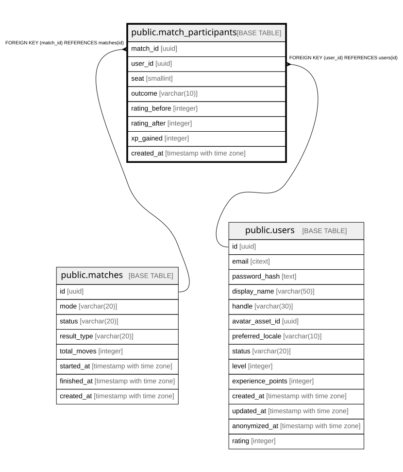

# public.match_participants

## Columns

| Name | Type | Default | Nullable | Children | Parents | Comment |
| ---- | ---- | ------- | -------- | -------- | ------- | ------- |
| match_id | uuid |  | false |  | [public.matches](public.matches.md) |  |
| user_id | uuid |  | false |  | [public.users](public.users.md) |  |
| seat | smallint |  | false |  |  |  |
| outcome | varchar(10) |  | true |  |  |  |
| rating_before | integer |  | false |  |  |  |
| rating_after | integer |  | true |  |  |  |
| xp_gained | integer | 0 | false |  |  |  |
| created_at | timestamp with time zone |  | false |  |  |  |

## Constraints

| Name | Type | Definition |
| ---- | ---- | ---------- |
| chk_match_participants_outcome | CHECK | CHECK (((outcome IS NULL) OR ((outcome)::text = ANY (ARRAY[('win'::character varying)::text, ('loss'::character varying)::text, ('draw'::character varying)::text])))) |
| chk_match_participants_rating | CHECK | CHECK (((rating_before >= 0) AND ((rating_after IS NULL) OR (rating_after >= 0)))) |
| chk_match_participants_seat | CHECK | CHECK ((seat = ANY (ARRAY[0, 1]))) |
| chk_match_participants_settled | CHECK | CHECK ((((outcome IS NULL) AND (rating_after IS NULL)) OR ((outcome IS NOT NULL) AND (rating_after IS NOT NULL)))) |
| chk_match_participants_xp_gained | CHECK | CHECK ((xp_gained >= 0)) |
| fk_match_participants_user | FOREIGN KEY | FOREIGN KEY (user_id) REFERENCES users(id) |
| fk_match_participants_match | FOREIGN KEY | FOREIGN KEY (match_id) REFERENCES matches(id) |
| match_participants_pkey | PRIMARY KEY | PRIMARY KEY (match_id, user_id) |

## Indexes

| Name | Definition |
| ---- | ---------- |
| match_participants_pkey | CREATE UNIQUE INDEX match_participants_pkey ON public.match_participants USING btree (match_id, user_id) |
| idx_match_participants_user | CREATE INDEX idx_match_participants_user ON public.match_participants USING btree (user_id) |

## Relations

---

> Generated by [tbls](https://github.com/k1LoW/tbls)
