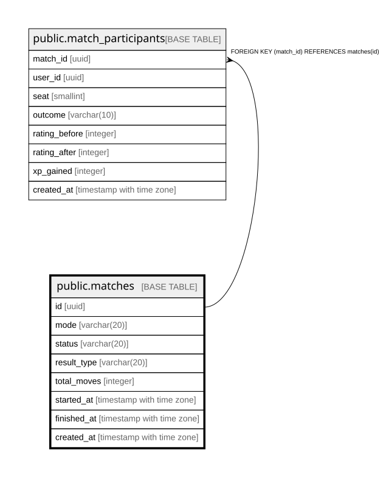

# public.matches

## Columns

| Name | Type | Default | Nullable | Children | Parents | Comment |
| ---- | ---- | ------- | -------- | -------- | ------- | ------- |
| id | uuid | gen_random_uuid() | false | [public.match_participants](public.match_participants.md) |  |  |
| mode | varchar(20) |  | false |  |  |  |
| status | varchar(20) | 'in_progress'::character varying | false |  |  |  |
| result_type | varchar(20) |  | true |  |  |  |
| total_moves | integer | 0 | false |  |  |  |
| started_at | timestamp with time zone |  | false |  |  |  |
| finished_at | timestamp with time zone |  | true |  |  |  |
| created_at | timestamp with time zone |  | false |  |  |  |

## Constraints

| Name | Type | Definition |
| ---- | ---- | ---------- |
| chk_matches_finished_after_started | CHECK | CHECK (((finished_at IS NULL) OR (finished_at >= started_at))) |
| chk_matches_finished_has_result | CHECK | CHECK ((((status)::text <> 'finished'::text) OR ((result_type IS NOT NULL) AND (finished_at IS NOT NULL)))) |
| chk_matches_mode | CHECK | CHECK (((mode)::text = ANY (ARRAY[('ranked'::character varying)::text, ('casual'::character varying)::text, ('ai'::character varying)::text, ('friend'::character varying)::text]))) |
| chk_matches_result_type | CHECK | CHECK (((result_type IS NULL) OR ((result_type)::text = ANY (ARRAY[('goal'::character varying)::text, ('resign'::character varying)::text, ('timeout'::character varying)::text, ('draw'::character varying)::text, ('abort'::character varying)::text])))) |
| chk_matches_status | CHECK | CHECK (((status)::text = ANY (ARRAY[('in_progress'::character varying)::text, ('finished'::character varying)::text, ('aborted'::character varying)::text]))) |
| chk_matches_total_moves | CHECK | CHECK ((total_moves >= 0)) |
| matches_pkey | PRIMARY KEY | PRIMARY KEY (id) |

## Indexes

| Name | Definition |
| ---- | ---------- |
| matches_pkey | CREATE UNIQUE INDEX matches_pkey ON public.matches USING btree (id) |
| idx_matches_status_finished | CREATE INDEX idx_matches_status_finished ON public.matches USING btree (status, finished_at DESC) |

## Relations

---

> Generated by [tbls](https://github.com/k1LoW/tbls)
