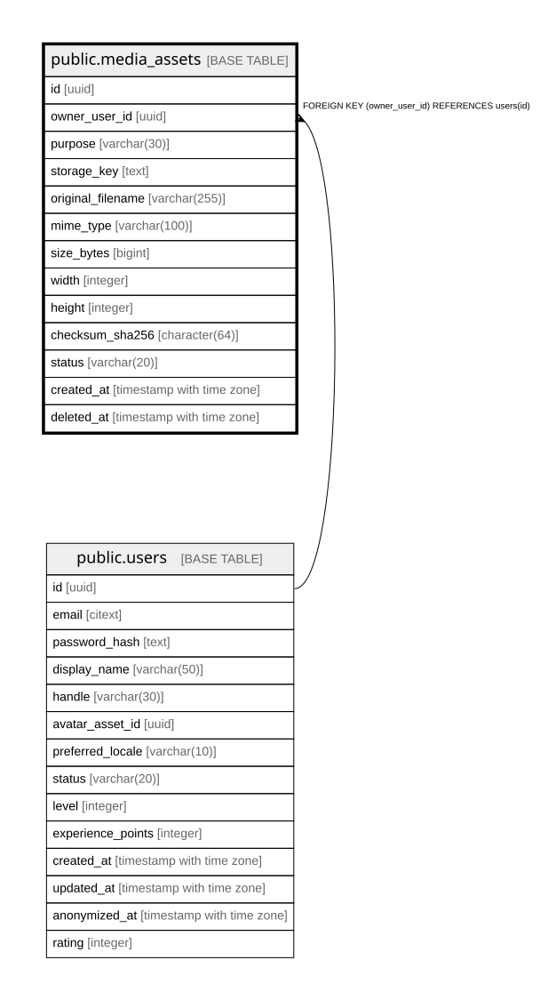

# public.media_assets

## Columns

| Name | Type | Default | Nullable | Children | Parents | Comment |
| ---- | ---- | ------- | -------- | -------- | ------- | ------- |
| id | uuid | gen_random_uuid() | false |  |  |  |
| owner_user_id | uuid |  | false |  | [public.users](public.users.md) |  |
| purpose | varchar(30) |  | false |  |  |  |
| storage_key | text |  | false |  |  |  |
| original_filename | varchar(255) |  | false |  |  |  |
| mime_type | varchar(100) |  | false |  |  |  |
| size_bytes | bigint |  | false |  |  |  |
| width | integer |  | true |  |  |  |
| height | integer |  | true |  |  |  |
| checksum_sha256 | character(64) |  | false |  |  |  |
| status | varchar(20) | 'active'::character varying | false |  |  |  |
| created_at | timestamp with time zone |  | false |  |  |  |
| deleted_at | timestamp with time zone |  | true |  |  |  |

## Constraints

| Name | Type | Definition |
| ---- | ---- | ---------- |
| chk_media_assets_purpose | CHECK | CHECK (((purpose)::text = 'avatar'::text)) |
| chk_media_assets_size_bytes | CHECK | CHECK ((size_bytes > 0)) |
| chk_media_assets_status | CHECK | CHECK (((status)::text = ANY (ARRAY[('active'::character varying)::text, ('deleted'::character varying)::text]))) |
| fk_media_assets_owner | FOREIGN KEY | FOREIGN KEY (owner_user_id) REFERENCES users(id) |
| media_assets_pkey | PRIMARY KEY | PRIMARY KEY (id) |

## Indexes

| Name | Definition |
| ---- | ---------- |
| media_assets_pkey | CREATE UNIQUE INDEX media_assets_pkey ON public.media_assets USING btree (id) |
| idx_media_assets_owner | CREATE INDEX idx_media_assets_owner ON public.media_assets USING btree (owner_user_id, purpose, status) |
| idx_media_assets_storage_key | CREATE UNIQUE INDEX idx_media_assets_storage_key ON public.media_assets USING btree (storage_key) |

## Relations

---

> Generated by [tbls](https://github.com/k1LoW/tbls)
