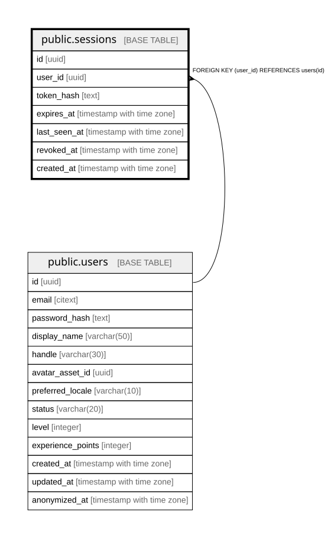

# public.sessions

## Description

## Columns

| Name | Type | Default | Nullable | Children | Parents | Comment |
| ---- | ---- | ------- | -------- | -------- | ------- | ------- |
| id | uuid | gen_random_uuid() | false |  |  |  |
| user_id | uuid |  | false |  | [public.users](public.users.md) |  |
| token_hash | text |  | false |  |  |  |
| expires_at | timestamp with time zone |  | false |  |  |  |
| last_seen_at | timestamp with time zone |  | false |  |  |  |
| revoked_at | timestamp with time zone |  | true |  |  |  |
| created_at | timestamp with time zone |  | false |  |  |  |

## Constraints

| Name | Type | Definition |
| ---- | ---- | ---------- |
| fk_sessions_user | FOREIGN KEY | FOREIGN KEY (user_id) REFERENCES users(id) |
| sessions_pkey | PRIMARY KEY | PRIMARY KEY (id) |

## Indexes

| Name | Definition |
| ---- | ---------- |
| sessions_pkey | CREATE UNIQUE INDEX sessions_pkey ON public.sessions USING btree (id) |
| idx_sessions_token_hash | CREATE UNIQUE INDEX idx_sessions_token_hash ON public.sessions USING btree (token_hash) |
| idx_sessions_user_expires | CREATE INDEX idx_sessions_user_expires ON public.sessions USING btree (user_id, expires_at) |

## Relations

---

> Generated by [tbls](https://github.com/k1LoW/tbls)
