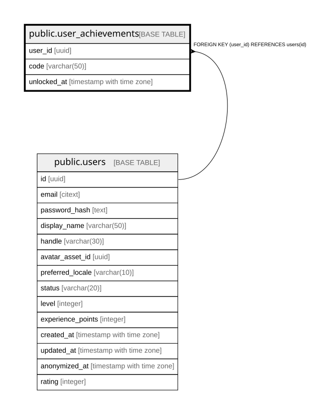

# public.user_achievements

## Columns

| Name | Type | Default | Nullable | Children | Parents | Comment |
| ---- | ---- | ------- | -------- | -------- | ------- | ------- |
| user_id | uuid |  | false |  | [public.users](public.users.md) |  |
| code | varchar(50) |  | false |  |  |  |
| unlocked_at | timestamp with time zone |  | false |  |  |  |

## Constraints

| Name | Type | Definition |
| ---- | ---- | ---------- |
| fk_user_achievements_user | FOREIGN KEY | FOREIGN KEY (user_id) REFERENCES users(id) |
| user_achievements_pkey | PRIMARY KEY | PRIMARY KEY (user_id, code) |

## Indexes

| Name | Definition |
| ---- | ---------- |
| user_achievements_pkey | CREATE UNIQUE INDEX user_achievements_pkey ON public.user_achievements USING btree (user_id, code) |

## Relations

---

> Generated by [tbls](https://github.com/k1LoW/tbls)
