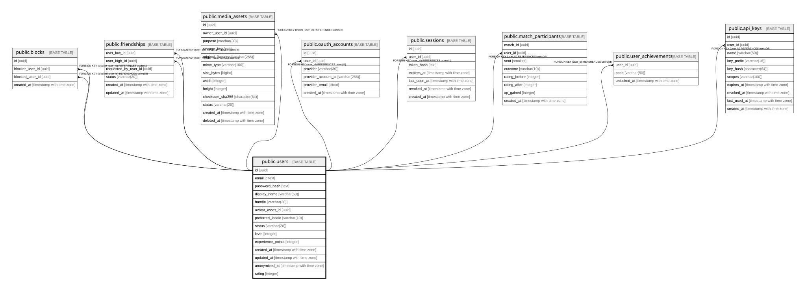

# public.users

## Description

## Columns

| Name | Type | Default | Nullable | Children | Parents | Comment |
| ---- | ---- | ------- | -------- | -------- | ------- | ------- |
| id | uuid | gen_random_uuid() | false | [public.blocks](public.blocks.md) [public.friendships](public.friendships.md) [public.media_assets](public.media_assets.md) [public.oauth_accounts](public.oauth_accounts.md) [public.sessions](public.sessions.md) |  |  |
| email | citext |  | true |  |  |  |
| password_hash | text |  | true |  |  |  |
| display_name | varchar(50) |  | false |  |  |  |
| handle | varchar(30) |  | false |  |  |  |
| avatar_asset_id | uuid |  | true |  |  |  |
| preferred_locale | varchar(10) | 'ja'::character varying | false |  |  |  |
| status | varchar(20) | 'active'::character varying | false |  |  |  |
| level | integer | 1 | false |  |  |  |
| experience_points | integer | 0 | false |  |  |  |
| created_at | timestamp with time zone |  | false |  |  |  |
| updated_at | timestamp with time zone |  | false |  |  |  |
| anonymized_at | timestamp with time zone |  | true |  |  |  |

## Constraints

| Name | Type | Definition |
| ---- | ---- | ---------- |
| chk_users_experience_points | CHECK | CHECK ((experience_points >= 0)) |
| chk_users_level | CHECK | CHECK ((level >= 1)) |
| chk_users_status | CHECK | CHECK (((status)::text = ANY (ARRAY[('active'::character varying)::text, ('suspended'::character varying)::text, ('deleted'::character varying)::text]))) |
| users_pkey | PRIMARY KEY | PRIMARY KEY (id) |

## Indexes

| Name | Definition |
| ---- | ---------- |
| users_pkey | CREATE UNIQUE INDEX users_pkey ON public.users USING btree (id) |

## Relations

---

> Generated by [tbls](https://github.com/k1LoW/tbls)
